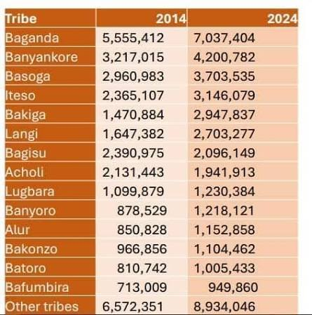

## 1a. A table that started a national crisis

In October 2024, the Uganda Bureau of Statistics (UBOS) published the
provisional results of the National Population and Housing Census. One table
— the population by tribe — set off a storm.

Look at the table for a moment. Does anything strike you as odd?

::: {.callout-note collapse="true"}
## What happened

Several tribes' 2014 baseline figures did not match the 2014 census. The
figures for four tribes had been transposed — each tribe given another
tribe's number — making their ten-year growth look impossible. UBOS
withdrew the report and reissued corrected figures.

We will come back to this story, and this data, throughout the workshop.
:::

## 1b. One idea behind all of it

Every visualisation — every plot, every table, every dashboard — is a
**mapping from data values to visual properties**.

| Data value | Visual property |
|------------|-----------------|
| a number | a position along an axis |
| a category | a colour, a shape |
| a magnitude | a length, an area, a font weight |

That is the whole idea. The rest of the workshop is about learning to see
it, and to use it deliberately.

## 1c. What maps to what?

::: {.callout-tip}
## Check your understanding

*Three examples coming here: a bar chart, a heat map, and a formatted
table. For each one, participants identify which data values map to which
visual properties.*
:::
